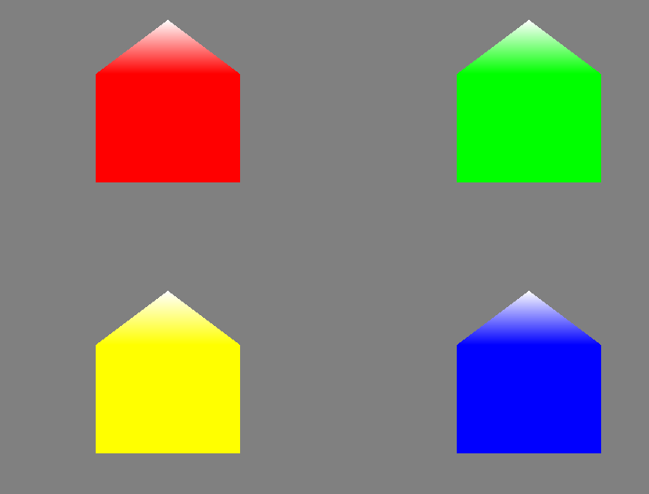

This chapter is explaining what are geometry shaders and what we can do with them.

First part of this chapter has shown that we can render 4 points in the scene that will be altered by geometry shader to become houses 

