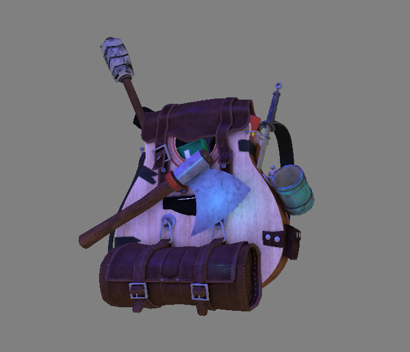

# Learning of OpenGL API

## Content of the repo
In this repostitory I am going to document and store my code  
while I am learning graphic API OpenGL by Khronos

# Structure

I am learning from the book called [Learn OpenGL](https://learnopengl.com)  

Basics of the OpenGL can be found in the main branch where each commits represents end of the chapter because chapters are following up on each other.  

### Branches 

When delving into advanced OpenGL each chapter is quite unique but is using the same codebase therefore I have chosen to use different branches. 

Each branch is covering one chapter in the book and I used the following naming

`advance-opengl-name-of-the-chapter`

With this approach, I can see different results of the chapter simply just by checking out to the different branch

**README** of each branch will contain screenshots of the scene that will be showing different outcomes of different rendering techniques 

# Scene

In the scene, you are able to move around with your mouse and with W, A, S, D

# Building

**YOU THEORETICALLY NEED TO ONLY CLONE THE REPO IN ORDER FOR IT TO WORK**

**BUT DONT FORGET TO REBUILD YOUR SOLUTION**

(and of course, opening the solution using Visual Studio 2022, and)

This project contains several 3rd party libraries like glm, glad etc...

They are built via cMake for **Visual Studio 17 (2022)** and compiled binaries are included in **3rdPartiesLibrieis** folder.

The project solution is using Visual Studio macros to tell the linker and compiler where to look for the compiled header files 

---

# End of the basic OpenGL

Contains rendered model using Assimp with Phong lighting model that has a blueish color 

Light sources are: point light, direction light 

