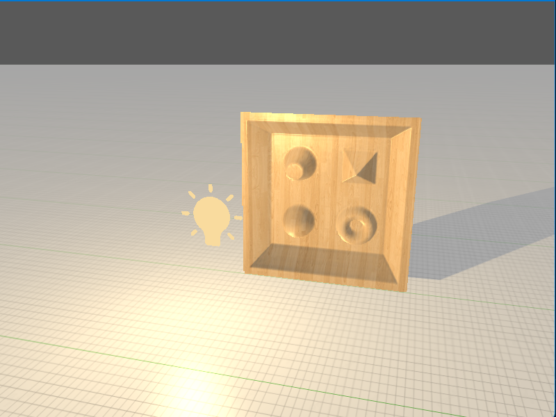
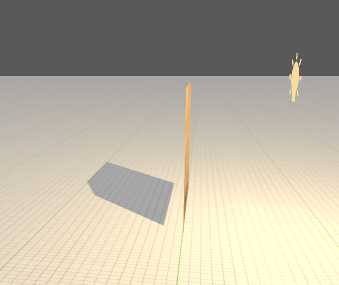
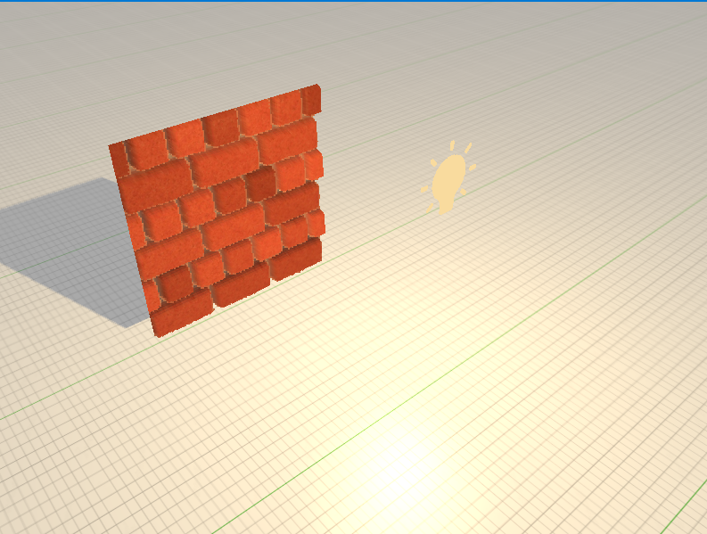

This chapter was a follow-up on the normal mapping chapter. We will use the height map that will offset the texture coordinates to create an illusion of the depth in the complete flat object/texture combined with the normal map it can give a pretty believable result

