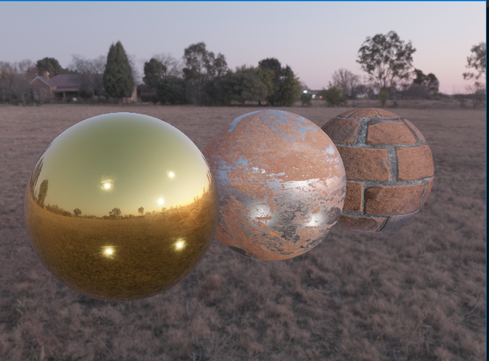

# Image-based lighting

This is the direct follow-up on the PBR-IBL chapter but instead of manually specifying the 

- Roughness
- AO
- Metalness
- Albedo
- Normal

We used texture to replicate real-life materials

We used GOLD, Rust-iron and Wall as our textures

