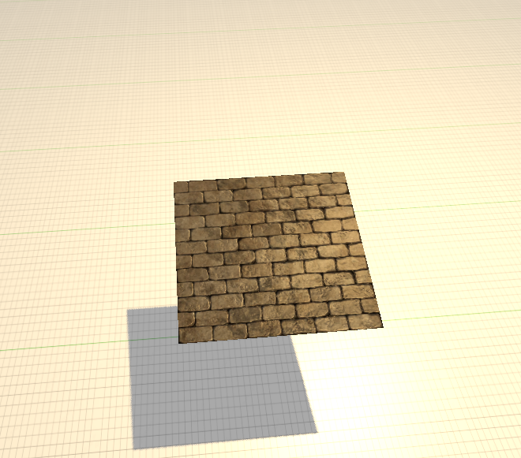
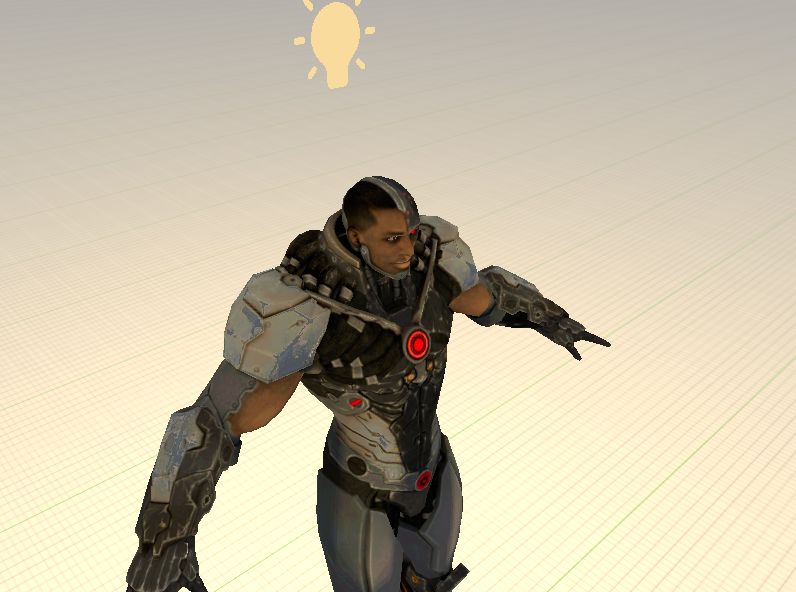

This chapter describes the technique called normal mapping where we add ilusion of depth to the completly flat texture by creating normal vectors for each fragment of the object instead for each surface / face of the object 

