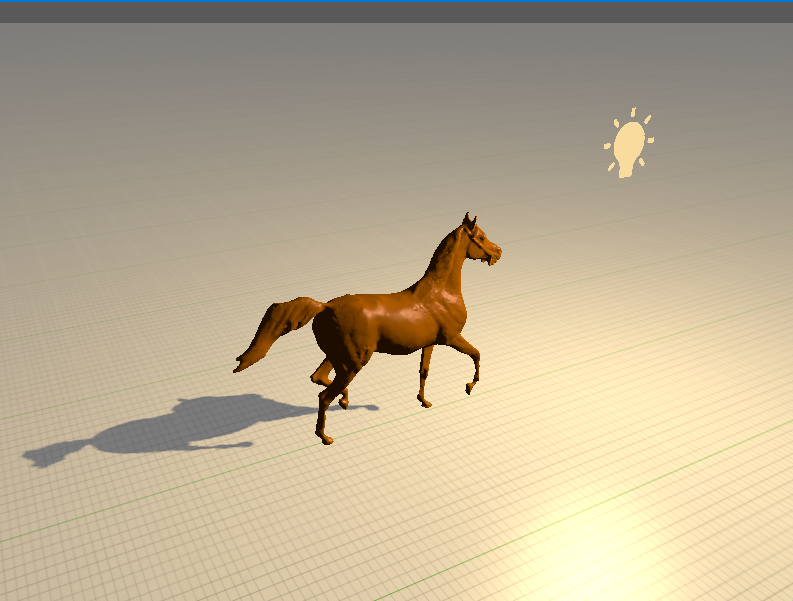

This is not a part of the book however I have imported the horse model and rendered it with brown like color

In order to see if, the shadow mapping technique works on more complex object

I also changed the floor texture to the grid-like texture

