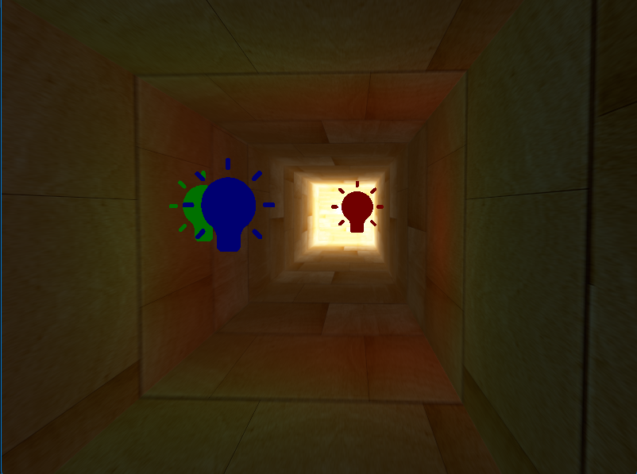

In this chapter we were trying to implement HDR that mimics the human eye regarding the light and allows the light properties to be bigger than the range of 0.0 and 1.0 which can improve the details visible in the scene that are under the influence of very bright lightning source 

The HDR is really visible in complex scenes with complicated light algorithms

