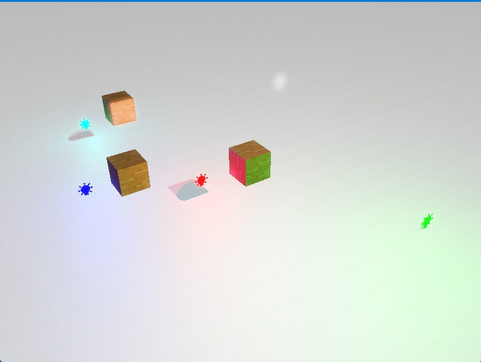

In this chapter we focused on post-proccessing effect called bloom which can give a light sources/ bright spots illusion as they were leeking through and therefore give the effect of shining

The bloom is very fragile effect and needs a lot of tweeking with its values in order to look most precise 
