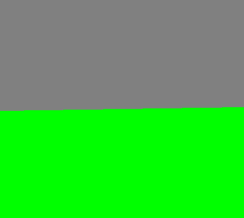

In this chapter we explored anti-aliasing and multiple sample buffer we eliminated the effect of pixelated edges of the cube by enabling multiple samples per pixel

> Before anti-aliasing

> After anti-aliasing

