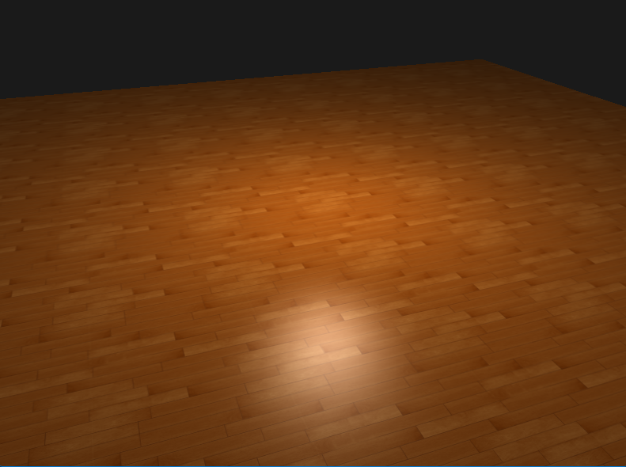
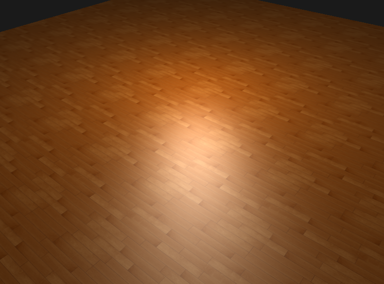

In the chapter we introduced Phong-Binn lightning model that adds more realism to the specular highlights that the traditional Phong lighting modelWe can switch between them in real-time

- Arrow UP - enable Blinn calculations
- Arrow DOWN - disable Blinn calculation and do only Phong calculations

>PHONG

>BLINN

