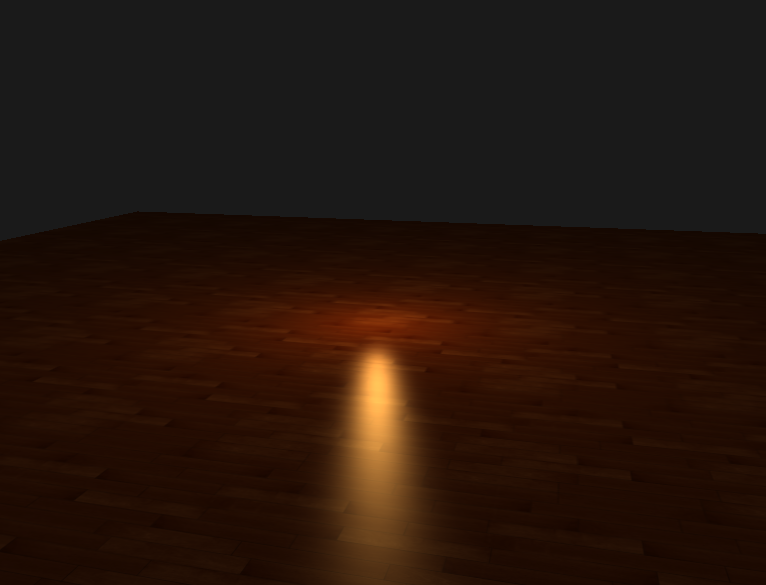
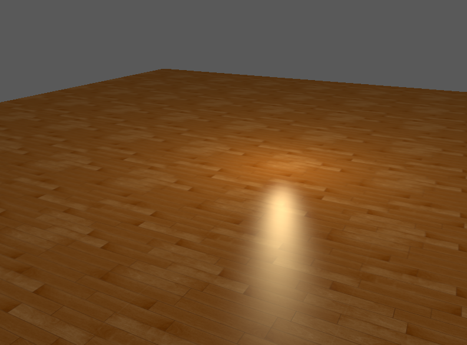
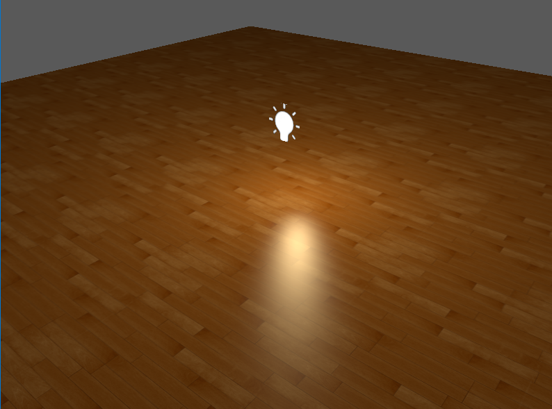

In this chapter, we discussed what is gamma correction and why does not color appear on the monitor in the way we define it 

We also introduced  multiple ways on how to fix this problem

>Gamma corection off

>Gamma corection on

