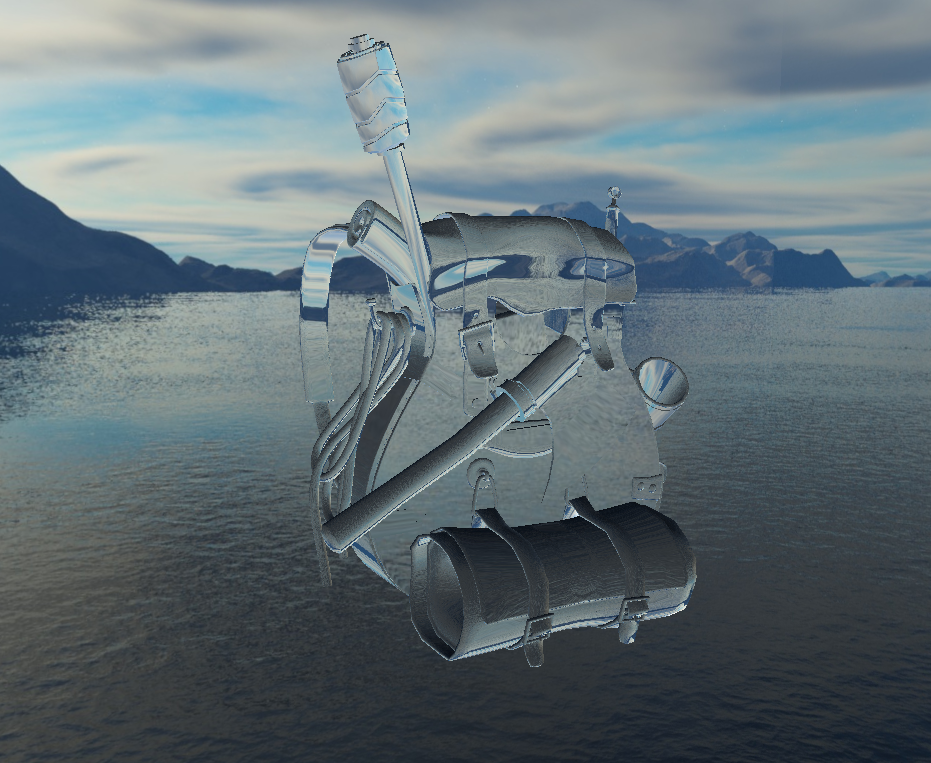

In this chapter we used 3D textures to map it around cube and subsequently to use that cube as a skybox. 

We also rendered the model from the end of the basic OpenGL and configure shader in such way that it looks like that the model is made from glass

