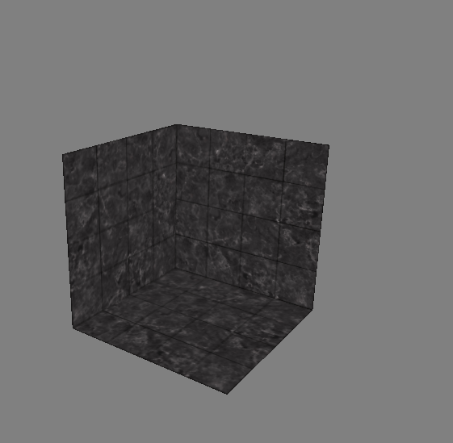

In this chapter, we used vertices and their writing as a way to determine which face of the cube is not facing the player and therefore we do not have to render those fragments, hence we save a lot of computing power

In this image we we are deleting front-facing faces of the cube to showcase the face culling

