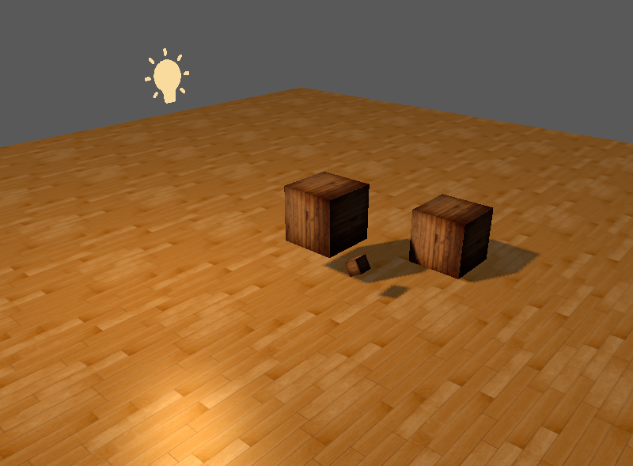

In this chapter, we discussed how to render shadows and how to make them look as believable as possible We rendered the scene from the light perspective and then mapped depth values to the texture that was attached to the frame buffer where the scene was rendered to, then we rendered the scene as normal on the default frame buffer

To calculate shadows we had to transform the positions of the objects to the light's POV and check whether their depth value is smaller or greater than the depth value of the shadow map

Then we had to fix the following issues raised by shadow generation

- shadow acne
- petter panning
- oversampling
- PCF

After everything was corrected the scene look like this

We used the directional light (like sun) and orthographical projection instead of the perspective projection for the rendering the scene from the light's POV

