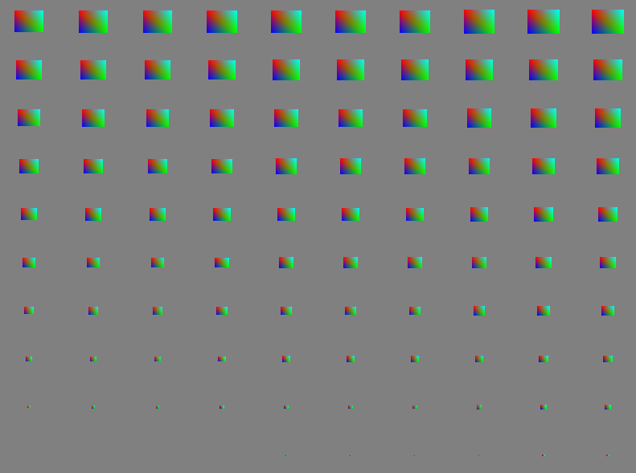
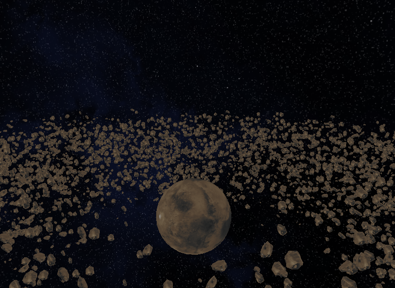

This chapter is focused on drawing a lot of objects without having to constantly communicate with the CPU using technique called instancing 

The first part of this chapter showed us how to use instancing and how to access certain elements (their vertex) in order to place them/scale them or preform different operations on them 

Second part was about rendering over 7000 models that with normal draw calls would be very slow we used instacing rendering technique to crate Jupiter and ring of asteroids around it I also added a space skybox and ambient lightning so that the scene looks more realistic 

