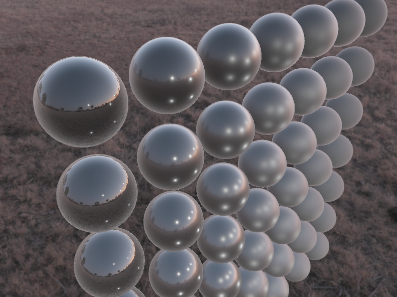
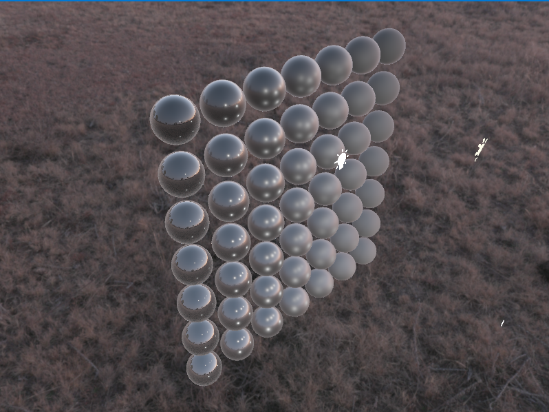

# Image-based lighting

In this chapter, we explored the realm of IBL where we used HDR environment texture that represents the indirect light source.

We have used Epic's game's technique used in Unreal Engine 4 called [Split sum approximation](https://cdn2.unrealengine.com/Resources/files/2013SiggraphPresentationsNotes-26915738.pdf)

Where we precomputed different parts of the rendering equation and stored them in the look-up textures that we later used for shading.

With this process, we were able to achieve incredibly realistic visuals

