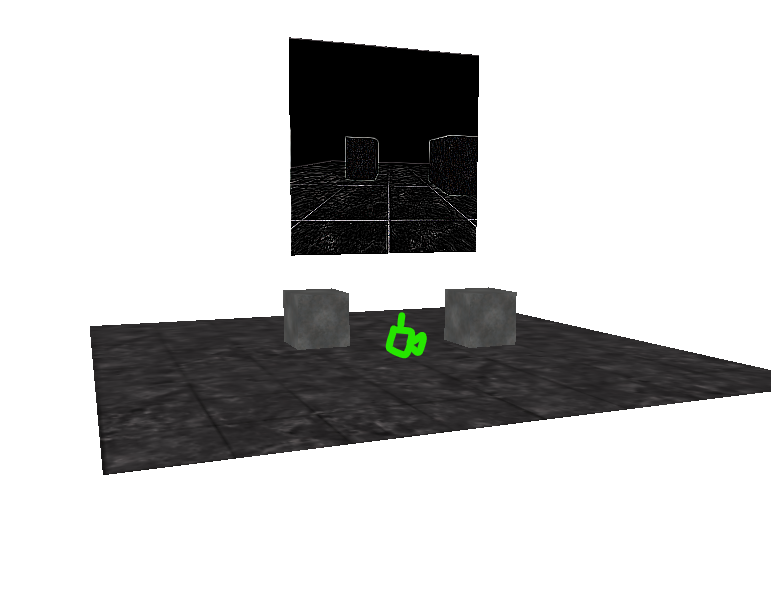
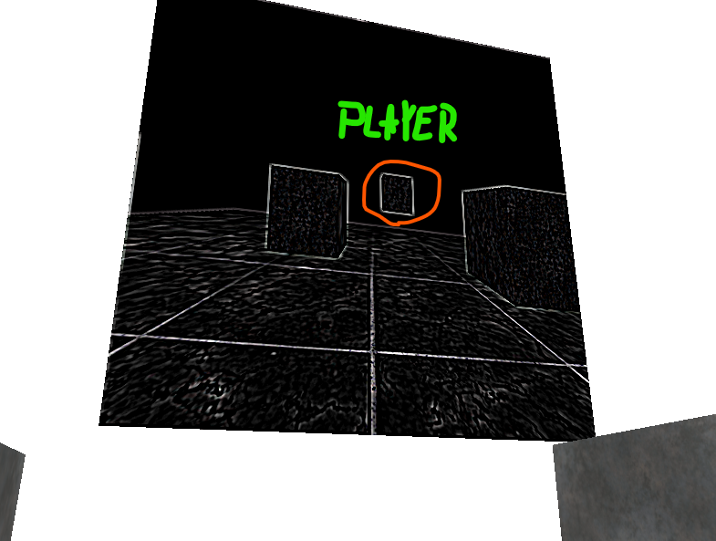

In this chapter, we used Frame buffer (buffer where we can draw a different scene on) and Kernel to add post-proccesing effect on the frame-buffer rendered scene

I created a static "screen" and another camera that is being projected on the screen where the player is visible when he is in the camera's FOV

