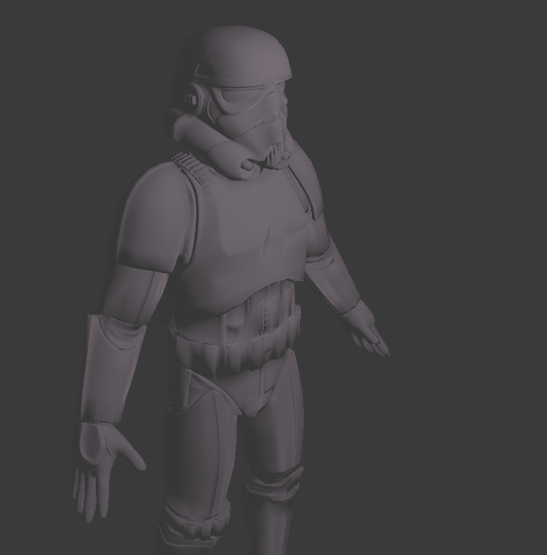
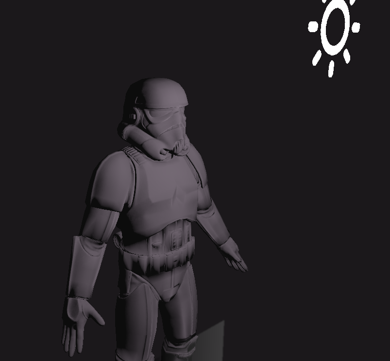

This chapter's main foccus was SSAO screen-space ambient occlusion

It is trying to simulate how does light shatter in the corners or holes

However its not as noticable effect it can add a lot realism to the scene 

>SSAO off

>SSAO on
