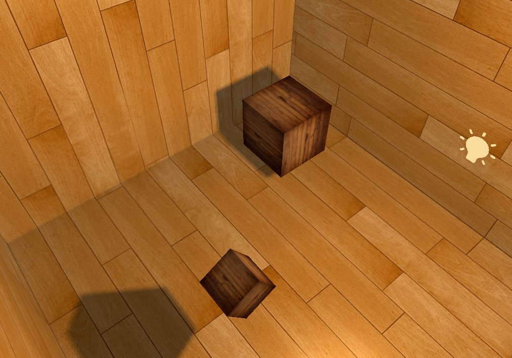

This chapter was again focused on the shadows however in this chapter instead of projecting shadows 
only on the plane we used the point shadows technique that draws the shadow map
on the cube texture

We used geometry shader to generate that texture as well as transformed the scene to be displayed in the big room-like cube 

We used PCF algorithm to make the shadows a little bit more soft

the scene now looks like this

