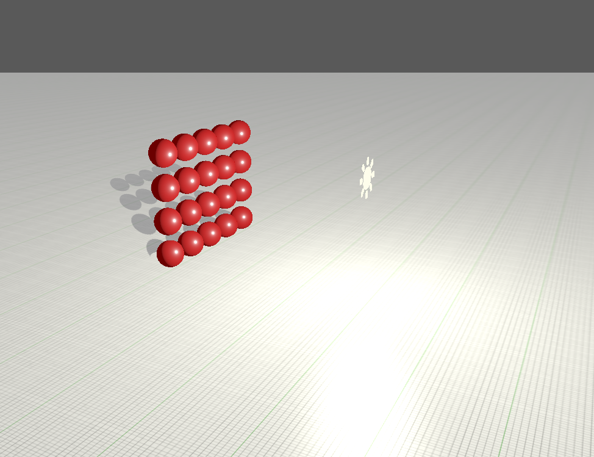
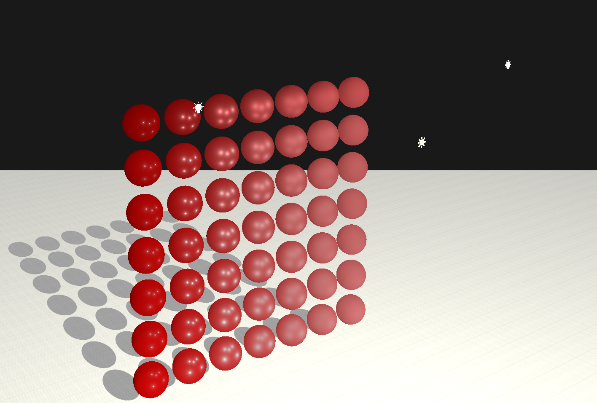

This chapter explained what Physics Based Rendering or PBR is and how it is calculated using rendering equation. 

First part of the chapter was focused on direction light wich was defined by us and not by the enviroment
 
> PBR with one light and one Metallic and Roughness property for every sphere 

> PBR with 5 lights and different Metallic and Roughness properties per sphere 
