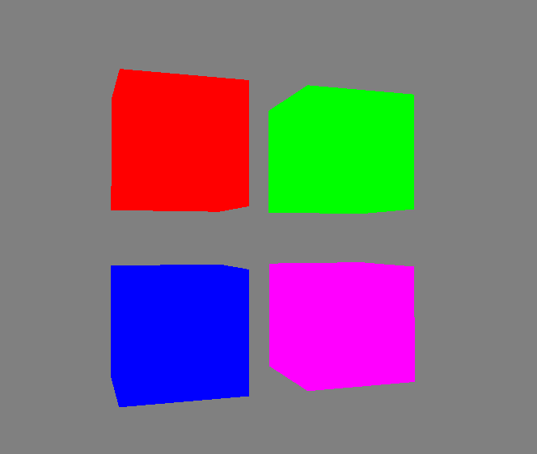

This chapter was focused on advanced techniques of GLSL shader language the main part was a UnifromBuffer object that allow us to share uniform across multiple shaders

Even though this chapter was not visually very impressive it introduced a lot of new memory management systems and filling in the buffer objects 

This scene contains 4 different cubes where that use the same vertex shader but a different fragment shaders and when passing view and projection Matricies we no longer have to pass them to the 1 shader program at the time 

